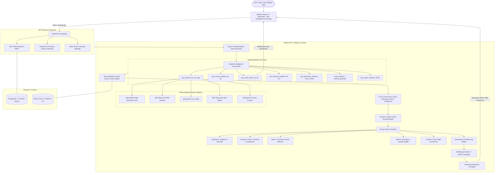

# WeatherGPT Architecture Documentation

WeatherGPT is a conversational weather intelligence and decision-support platform designed for the **Smart India Hackathon (SIH 2026)**.

The guiding product design principle is:
> **"Data → Context → Risk → Decision"**

WeatherGPT is explicitly positioned not as a replacement for meteorological bodies (e.g. IMD, ECMWF, NOAA), but as:
> **"A conversational intelligence and decision-support layer over existing meteorological infrastructure."**

---

## 1. System Architecture Diagram

---

## 2. Zero-Hallucination Guarantee

The LLM is **never** permitted to generate or interpolate raw numerical weather metrics or manufacture emergency alerts. 

1. **Retrieval First**: All weather parameters (temperature, humidity, precipitation sum, probability, wind speed, pressure, UV index) must be returned by verified adapters.
2. **Deterministic Context**: Rules regarding irrigation suitability (soil moisture and rain probability thresholds) and pesticide drift (wind speed and 24h rainwash risk) are calculated deterministically by domain algorithms before being presented to the reasoning layer.
3. **Official Warning Supremacy**: Government alerts issued by IMD Regional Meteorological Centers take highest precedence and cannot be softened or downgraded by the AI.

---

## 3. Data Flow

1. **User Query**: User submits `"Should I irrigate my paddy field tomorrow in Hyderabad?"` via text or voice.
2. **Query Understanding**: `IntentParser` identifies:
   - Intent: `agriculture_advisory`
   - Location: `Hyderabad (17.3850° N, 78.4867° E)`
   - Time: `Tomorrow`
   - Sector: `Agriculture / Farmer`
   - Crop: `Paddy`
   - Language: `en`
3. **Tool Dispatching**: Orchestrator calls:
   - `get_forecast(17.3850, 78.4867, days=7)`
   - `get_active_alerts(17.3850, 78.4867)`
4. **Data Fusion & Validation**: Cache check, coordinate validation, data freshness calculation (`data_age_minutes = 2.5`), and confidence assessment (`HIGH`).
5. **Context Evaluation**: Tomorrow's precipitation probability evaluated:
   - If rainfall probability $\ge 50\%$ or rainfall $\ge 5.0\text{ mm}$, verdict is `DELAY_IRRIGATION`.
6. **Multilingual Formatting**: Translates response if user language is Telugu, Hindi, Tamil, Kannada, Malayalam, Bengali, or Marathi while preserving exact numerical metrics.
7. **Response Delivery**: Frontend renders structured card with action badge, weather summary chips, official citations, and text-to-speech audio.
